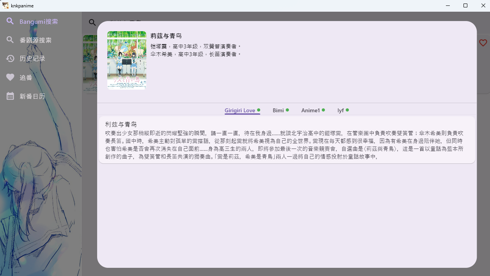
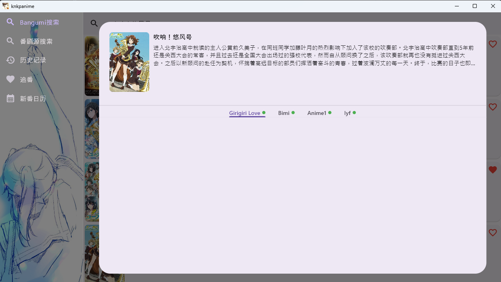
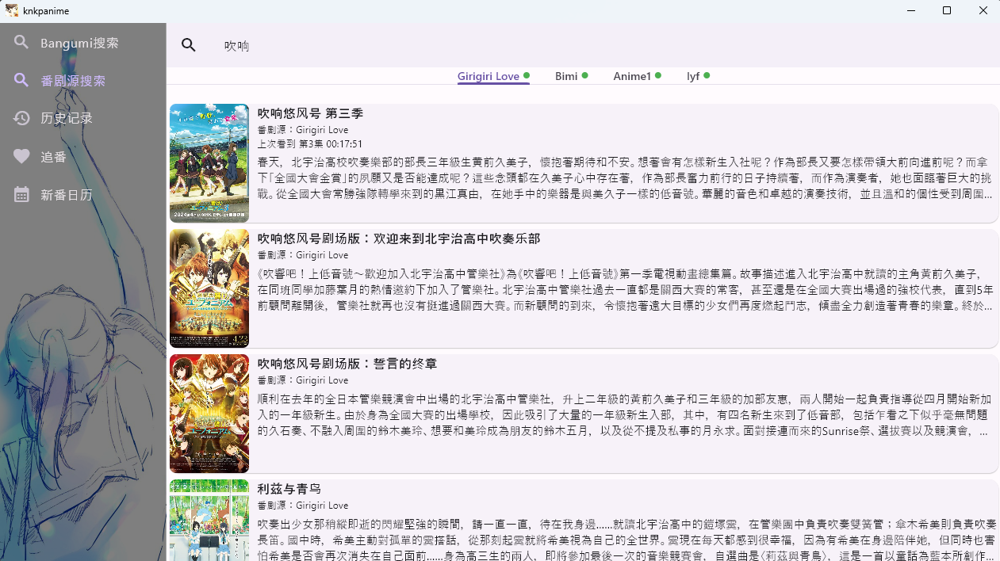

# knkpanime

还在写... 姑且算是个介绍：

支持多番剧源和弹幕的看番软件。

（~~虽然说理论上甚至能已经接入电视剧的网站~~ 甚至已经接入了电视剧网站）

关于平台：开发过程中只在Windows上测试过，也对安卓做了一点适配，但由于没有安卓设备，所以不知道能跑成什么样。欢迎安卓用户测试。

有问题或建议可以通过issue反馈。~~我真的想要issue到不行了，有没有好心人能给我提一个issue啊~~

[下载链接](https://github.com/KNKPA/KNKPAnime/releases/latest)

## 介绍

最重要的当然就是搜索啦。作为一个支持多番剧源的软件，你可以先在Bangumi上搜索想看的番剧，再选择可用的源观看：

当然，有的时候也会因为不同译名或番剧名中有特殊符号而导致使用Bangumi搜索很难匹配到番剧源中的数据，这个时候就可以用番剧源搜索来自定义用来搜索的词：

然后就是一些比较常规的功能 - 历史记录、追番、番剧更新日历等，应该不需要过多介绍。

## Windows 报毒

目前下载Windows版可能在一些设备上会被Windows Defender报毒。经过我二十分钟的调查只能发现还有一些flutter项目也有同样问题，但没有找到解决方案。~~We are actively working on it~~.

## Acknowledgement

本项目受[oneAnime](https://github.com/Predidit/oneAnime)启发，并在Anime1的适配器中借用了其代码。

本项目使用了[Bangumi](http://bangumi.tv/)、[dandanplay](https://www.dandanplay.com/)的开放API。网站运营不易，请各位在能力范围内尽量支持这两个网站的运营。